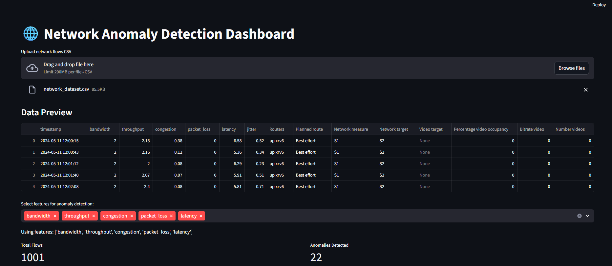

# Hi, I’m Karthick K 👋
**Aspiring AI/ML Engineer** • B.Tech in Artificial Intelligence & Machine Learning (2025)  
Building ML & DL projects — recommender systems, anomaly detection, and practical apps.

---

## 🔭 Featured Projects
### Conversational Movie Recommendation & Q&A Chatbot
# 🎬 Conversational Movie Recommendation & Q&A Chatbot  

An **AI-powered chatbot** that combines **movie recommendations** with **conversational Q&A** for an engaging user experience.  
Built with **Python** and **Streamlit**, the system integrates **LangChain memory** and the **Gemini API** for natural conversations, while leveraging **FAISS** and **BERT embeddings** for semantic search.  

---

## 🔑 Features  
- 🎥 **Movie Recommendations with Posters** – Fetches movie suggestions with posters from the **TMDb API**  
- 🧠 **Conversational Memory** – Maintains context using **LangChain memory** for smooth dialogue  
- 🔎 **Semantic Search** – Uses **FAISS vector store + BERT embeddings** to find contextually similar movies  
- 💬 **Dual Mode** – Handles normal questions with Gemini API and switches to recommendation mode when user input contains keywords like *recommend* or *give*

---

## 🛠️ Tech Stack  
- **Python (Anaconda)**  
- **Streamlit** (frontend)  
- **LangChain** (memory & orchestration)  
- **Gemini API** (LLM responses)  
- **FAISS + BERT** (vector search & embeddings)  
- **TMDb API** (movie data & posters)  

---

## 🚀 Project Highlights  
This project showcases the integration of **LLMs, vector search, NLP, and external APIs** into a single, interactive chatbot application — enabling users to **discover movies** and **ask questions conversationally** in a seamless experience.  

---

### Anomaly-detection
Streamlit app that detects anomalies in network data (CSV upload + processing). 

**Repo:** `Anomaly-detection` • *Data preprocessing, visualization, threshold based detection.*

---

## 🛠️ Tech & Tools
Python • PyTorch • Scikit-learn • Pandas • NumPy • Streamlit • Git  • TMDB API

---

## 📫 Contact
- LinkedIn: https://www.linkedin.com/in/karthick2434  
- Email: karthick24032004@gmail.com

---

## 🔁 What I’m working on
- Upgrading recommender from TF-IDF to BERT sentence embeddings (sentence-transformers)
- Adding unit tests and CI for key projects

---

If you like, I can customize this README text (add GIFs/screenshots, badges, project links).
